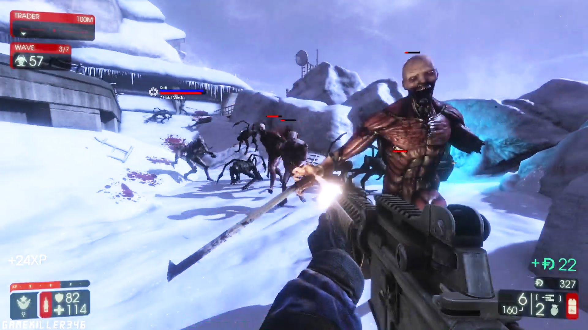

# KiwiGames 🥝

For this project we are going to use JavaScript and Phaser Libraries.

## Authors

| Authors | Mail |
| - | - |
| *[Álvaro Serna Ramírez](https://github.com/alsern01)* | alsern01@ucm.es | 
| *[Sergio Alberto Luis Cano](https://github.com/serluis)* | serluis@ucm.es |

## Description

We are going to do a 8-bits remake of the video game KillingFloor2, game known for massive zombies slaughter. We are going  to inspire in games like Age of Zombies (Android)
to come closer to KillingFloor2 mechanics.
In the game you are a mercenary paid for kill all the horrible experiments that flee from a military lab.

The game is going to be a 2D arcade, top-down vision which you face hordes of enemies, equipped with different weapons which you can upgrade. You win money for each enemy beaten. you can use that money to buy weapons on the store or upgrade what you have.
It´s important ammunition management, so its limited. You can only refill supplies once the round is over. Be careful or you have to kill them on close combat.
Our character can choose between a few classes at the beginning or the end of round.
Each of those give us different bonuses.
The enemies will be more and more, and more powerful each horde.
It will be possible that a boss appear at lasts rounds.

FIGHT FOR YOUR LIVE, EARN MONEY, KILL ZOMBIES!

Click [here](https://serluis.github.io/KiwiGames/dist/) to play the game!

[Age of Zombies](https://ageofzombies.com), Halfbrick Studios.

Killing Floor 2 www.killingfloor2.com, TripWire Studios.

# KiwiGames 🥝

## Autores

| Autores | Mail |
| - | - |
| *[Álvaro Serna Ramírez](https://github.com/alsern01)* | alsern01@ucm.es | 
| *[Sergio Alberto Luis Cano](https://github.com/serluis)* | serluis@ucm.es |

## Descripción

Vamos a hacer un remake en 8-bits del videojuego Killing Floor 2, juego conocido por su masacre de zombies masiva. 
Nos vamos a inspirar en juegos como Age of Zombies (Android) para acercarnos en lo posible a las mecánicas de Killing Floor 2.

En el juego eres un mercenario contratado para acabar con los horribles experimentos que han escapado de un laboratorio militar. 

El juego será un arcade 2D con vista top-down en el cual te enfrentarás a hordas de enemigos con distintas armas que se podrán mejorar al final de cada oleada.
Ganarás dinero por cada enemigo derrotado. Con ese dinero se puede comprar un arma nueva en la tienda o mejorar la que posees. 
Será importante la gestión de la munición, porque es limitada y solo se podrá recargar tu arma en la tienda tras cada ronda, se cauteloso con cada disparo si no quieres acabar a machetazos con ellos. 

Nuestro personaje podrá elegir una clase al principio de cada partida o al final de cada ronda. Cada clase aportará determinadas habilidades y mejoras a nuestro personaje.

Los enemigos serán cada vez más numerosos y variados tras cada ronda completada. Y en determinada oleada podrá aparecer un jefe, un enemigo más duro y más complicado de matar.

¡ LUCHA POR TU VIDA, GANA DINERO, MATA ZOMBIES !

¡Haz click [aquí](https://serluis.github.io/KiwiGames/dist/) para jugar!

Para este proyecto usaremos JavaScript y la librería de Phaser.

Presentación hito 1:
[Hito1](https://prezi.com/view/AC3ALxfsDxJTNtrBg9DO/)
